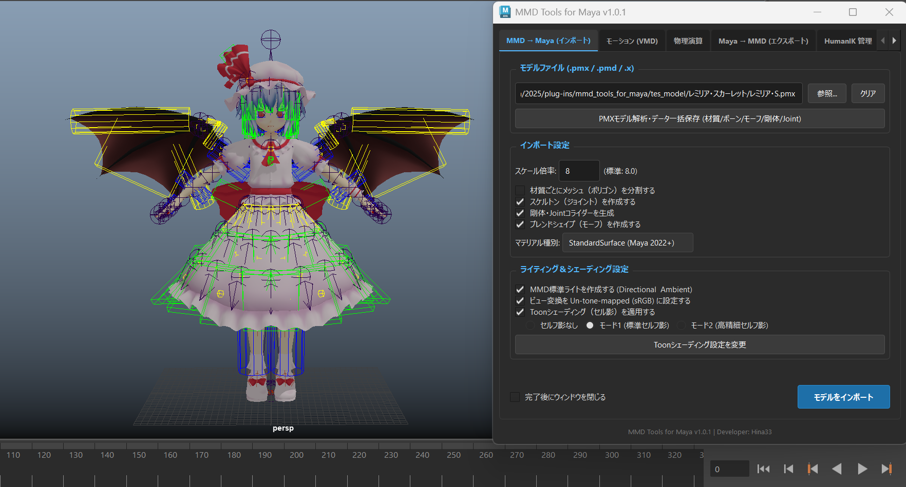

# MMD Tools for Maya (v1.0.1)

<p align="center">
  
</p>

Autodesk Maya 上で MMD（PMX / PMD / DirectX .x）形式のモデルやアクセサリのインポート・エクスポート、VMDモーション・カメラ・音声のインポート、HumanIKリグ定義、モデル構造の一括解析・辞書登録、および物理演算ベイクを行うための Maya 統合拡張プラグインです。

> [!NOTE]
> 本バージョン（**v1.0.1**）は、PMX詳細解析・一括保存・辞書登録機能、HumanIK脚部姿勢安定化、二重IK競合解除、物理演算パス最適化等の最新機能を統合した安定版です。モデルのインポート、モーション適用、物理演算ベイク等の一連のワークフローが動作確認されています。モデルのエクスポートの動作確認は未検証です。

---

## 主な特徴

- **オリジナル入出力エンジン (`mmd_core`) 搭載**:
  - 外部ライブラリ（`blender_mmd_tools` 等）に依存せず、純粋な Python 標準ライブラリのみでゼロから構築された高速・堅牢なパーサー＆ライター。
  - **PMX 2.0 / 2.1**: 頂点、BDEF/SDEF/QDEFウェイト、面、材質、テクスチャ、ボーン、モーフ、剛体、ジョイントの入出力に対応。
  - **PMD (MMD旧形式)**: ボーン、IK（インバースキネマティクス）、モーフ、面巻き順の反転補正に対応。
  - **DirectX .x**: フリーフォーマット字句解析（トークナイザー）により、改行・コメント・多様な区切り文字を含むメッシュやアクセサリを安定パース。
- **PMX モデル詳細解析・一括保存 & 未登録ボーン辞書登録機能 (`pmx_analyzer`)**:
  - 読み込んだモデルの **材質、ボーン、モーフ、剛体、Joint** の全パラメータを JSON 形式にワンクリックで一括エクスポート。
  - `jaka.py` に未記載の漢字・ボーン名が存在する場合に自動検出し、「登録のないボーン名があります。ユーザー辞書に記録しますか？」と確認。
  - GUI 上で漢字の隣にローマ字を入力して即時登録・自動再チェック（サイドチェック）を実行。
- **デュアル物理演算エンジン（本家 Bullet ＆ 自作 XPBD）**:
  - **Bullet 物理ベイク (MMD本家仕様)**: Bullet Physics 2.83.7 コアを直接 C++ 単一 DLL（`mmd_bullet.dll`）に組み込み、本家 MikuMikuDance 特有の「柔らかく綺麗なしなやかさ」を Maya 上で再現。
  - **XPBD 物理ベイク (自作C++エンジン)**: 拡張位置ベース物理（XPBD）による高剛性・低ジッターな高速シミュレーション。
  - **物理キーフレーム管理**: ワンクリックでのモデル再吸着や物理キーフレームのクリアに対応。
- **VMD モーション / カメラ / 音声インポート**:
  - 高精度な 4次ベジェ補間曲線ソルバー（MMD $\leftrightarrow$ Maya 座標系・回転オーダー変換対応）。
  - IK / ボーン追従の動的フレーム同期。カメラ・照明・WAV音声の一括インポート対応。
- **HumanIK キャラクタ定義 & コントロールリグ自動生成**:
  - PMXボーン構造を自動解析し、Maya 標準の HumanIK キャラクタ定義とリグをワンクリックで構築。
  - 数学的最短回転ベクトルによる両腕の水平 T ポーズ展開、膝の優先屈曲角度（`preferredAngle`）＆プレベンド設定、つま先ボーン連動、および二重IK競合の自動安全解除を搭載。
- **大容量・中国語モデル対応 & 安全なノード名変換**:
  - 簡体字・未知文字・特殊記号を含むモデルでも、名前の衝突や Maya の命名制限エラーを自動回避するセーフノードネーミング機構を搭載。
- **Maya 2025 最適化モダン UI**:
  - PySide6 / PySide2 両対応。単一の統合タブウィンドウで直感的な操作感を提供。

---

## 動作要件

- **Autodesk Maya**: 2022 / 2023 / 2024 / 2025 以降 (Python 3 環境)
  - **Maya 2025 動作確認済み**
- **OS**: Windows (x64)のみ動作確認済み

---

## インストール手順

Maya の標準プラグインディレクトリ（`plug-ins`）に配置してロードします。

### 1. ファイルの配置構造

Maya のプラグインフォルダに、以下の構造で配置してください：

```text
C:\Users\<ユーザー名>\Documents\maya\<バージョン>\plug-ins\
├── mmd_tools_for_maya_plugin.py      # 【必須】プラグインローダー (Mayaが直接ロードするファイル)
└── mmd_tools_for_maya/               # 【必須】プラグイン本体パッケージフォルダ
    ├── __init__.py
    ├── ui/
    ├── converters/
    ├── pmx_analyzer/
    ├── mmd_core/
    ├── bullet_engine/
    ├── cpp_engine/
    ├── asset/
    └── toon/
```

### 2. Maya でのロード手順

1. Maya を起動します。
2. 上部メニューから **ウィンドウ (Windows) > 設定/プリファレンス (Settings/Preferences) > プラグイン マネージャ (Plug-in Manager)** を開きます。
3. プラグイン一覧の中から **`mmd_tools_for_maya_plugin.py`** を探します。
4. **ロード (Loaded)** および **自動ロード (Auto load)** のチェックボックスをオンにします。
5. Maya メインメニューバーの右端に **[MMD]** メニューが追加され、**MMD to Maya (GUI)** をクリックするとツールウィンドウが起動します。

---

## 技術仕様書 (Technical Specifications)

本プラグインの内部アーキテクチャや計算モデルについては、[docs/](docs/) フォルダ内に詳細な技術ドキュメントを用意しています。

| ドキュメント名                                                                        | 概要・対象機能                                                                                                                                                         |
| :------------------------------------------------------------------------------------ | :--------------------------------------------------------------------------------------------------------------------------------------------------------------------- |
| [codebase_architecture_specification.md](docs/codebase_architecture_specification.md) | **コードベース全体アーキテクチャ**: モジュール構造、GUI・エンジン・パーサー分離原則、例外安全設計                                                                      |
| [pmx_analyzer_specification.md](docs/pmx_analyzer_specification.md)                   | **PMXモデル詳細解析 & ユーザー辞書仕様**: 材質・ボーン・モーフ・剛体・Joint一括保存、未登録漢字抽出、対話型登録GUI・再チェック                                         |
| [bullet_engine_specification.md](docs/bullet_engine_specification.md)                 | **Bullet Physics 2.83.7 エンジン仕様**: MMD本家物理再現、単一DLL組み込み、剛体・ジョイントパラメータ定義、衝突グループ(1〜16)・16bitマスク仕様、OpenMayaマトリクス逆算 |
| [physics_system_specification.md](docs/physics_system_specification.md)               | **Maya物理システム統合仕様**: ビューポート可視化コライダーメッシュ生成、Kinematic/Dynamic追従階層、自動再吸着・置き去り解消機構                                        |
| [xpbd_engine_specification.md](docs/xpbd_engine_specification.md)                     | **自作XPBD物理エンジン仕様**: 拡張位置ベース物理（XPBD）による剛体・6DOFばね拘束ソルバー、サブステップ積分、衝突判定                                                   |
| [model_import_specification.md](docs/model_import_specification.md)                   | **モデルインポート・エクスポート仕様**: PMX 2.0/2.1、PMD、DirectX .x、SDEFスキニング、マテリアル・テクスチャ変換                                                       |
| [vmd_import_specification.md](docs/vmd_import_specification.md)                       | **VMDモーションインポート仕様**: ベジェ補間曲線計算、IKベイク、カメラ・照明・音声インポート、オイラー角最短補正                                                        |

---

## ライセンスについて (License & Modular Isolation)

本プロジェクトは、オープンソースの透明性と利用者の自由度を最大限に高めるため、**フォルダ単位でのライセンス分離設計（カプセル化）** を採用しています。

- **プラグイン本体**: **MIT License**
  - 入出力コア（`mmd_core/`）、自作XPBD物理エンジン（`cpp_engine/`）、解析ツール（`pmx_analyzer/`）、GUI（`ui/`）、各種ユーティリティ等はすべて MIT ライセンスです。
- **Bullet エンジンモジュール (`bullet_engine/`)**: **zlib License**
  - Bullet Physics Library（Erwin Coumans / Bullet 公式）のソースコードを含みます。

### 削除耐性と 100% MIT ライセンスへの復元

- 商用利用やライセンスポリシー等の理由で Bullet Physics を除外したい場合、**`bullet_engine/` フォルダを丸ごと削除するだけ** で、プロジェクト全体が自動的に **100% 純粋な MIT License 単一構成** に戻ります。
- GUI は Bullet モジュールの存在を動的に検出し、フォルダが削除されていても一切エラーを出さず、自作 XPBD 物理エンジン側で全機能が通常通り動作し続けます。

---

## スペシャルサンクス

- [mmdpaimaya](https://github.com/phyblas/mmdpaimaya) を参考にさせていただきました。

---

## AIネイティブ開発 (AI-Powered Development)

本プロジェクトは、**最先端AIアシスタント（Google Antigravity / Gemini）とのペアプログラミング**により開発されています。

---

## クレジット

- **Author**: Hina33
- **Bullet Physics Library**: Copyright (c) 2003-2015 Erwin Coumans (zlib License)
- **スクリーンショット使用モデル**: 『レミリア・スカーレット』 モデリング・セットアップ：すけ 様（[ニコニ立体: td27083](https://3d.nicovideo.jp/works/td27083)）
