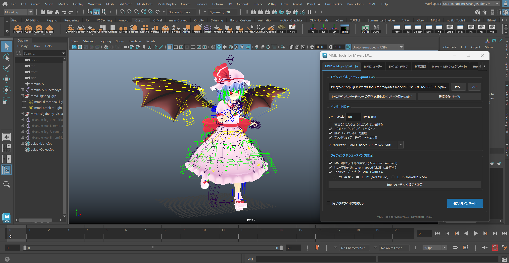
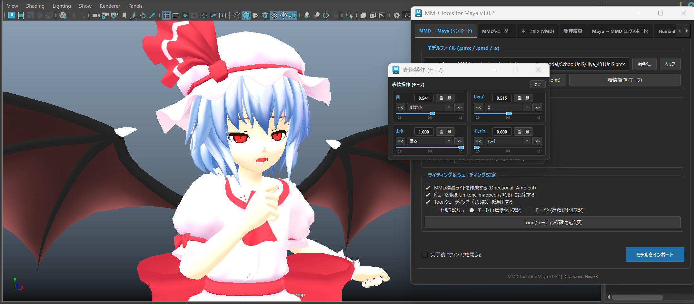

# MMD Tools for Maya (v1.0.2)

<p align="center">
  
</p>

<p align="center">
  
</p>

Autodesk Maya 上で MMD（PMX / PMD / DirectX .x）形式のモデルやアクセサリのインポート・エクスポート、VMDモーション・カメラ・音声のインポート、HumanIKリグ定義、モデル構造の一括解析・辞書登録、および物理演算ベイクを行うための Maya 統合拡張プラグインです。

> [!NOTE]
> 本バージョン（**v1.0.2**）は、PMX二重構造透過材質（首影・頬線など）の完全透過描画、MMDシェーダーアサイン時の受光色・環境光・明度適正化、PMX詳細解析・一括保存・辞書登録機能、HumanIK脚部姿勢安定化、二重IK競合解除、物理演算パス最適化等の最新機能を統合した安定版です。モデルのインポート、モーション適用、物理演算ベイク等の一連のワークフローが動作確認されています。モデルのエクスポートの動作確認は未検証です。表情操作（モーフ）時のライティングが不安定です。

---

## 主な特徴

- **MMDモデル（PMX / PMD / アクセサリ .x）をワンクリックでMayaに綺麗に読み込み**:
  - 面倒な設定なしで、キャラクターのメッシュ、ボーン（骨組み）、ウェイト、テクスチャ、表情モーフまで自動でMaya内に正しく展開します。
  - **PMX (2.0 / 2.1)**: 最新のMMDモデルをフルサポート。
  - **PMD (旧形式)**: 初期のMMDモデルも読み込めます。
    > [!NOTE]
    > **【PMDモデルの注意点】**: PMDは初期の古い規格のため、髪やスカートなどを揺らす**物理演算（剛体・ジョイント）には対応していません**。物理演算を利用したい場合は、事前に「PMXエディタ」等でPMX形式に保存し直してから読み込んでください（ボーンの動きや表情モーフはそのまま読み込めます）。
  - **DirectX (.x)**: 武器やステージなどのアクセサリ小物も手軽に取り込めます。

- **本家MMDの見た目・色合いをそのまま再現する「MMD専用シェーダー」**:
  - Mayaに取り込んだ際に発生しやすい「白飛び」「暗くなる」「テクスチャのズレ」を解消し、MMD本家のようなアニメ調の影（トゥーン影）、ツヤ（スフィア）、きれいな輪郭線（アウトライン）をMayaの画面上で忠実に再現します。
  - **首の影や頬のチークも綺麗に透ける（二重構造透過対応）**: 半透明のテクスチャが重なる部分が黒く潰れず、チラつきのない自然なグラデーションで綺麗に重なって表示されます。
  - **既存モデルへのワンクリック適用**: 「MMDシェーダーを選択モデルにアサイン」ボタンを押すだけで、すでにMaya上にあるモデルのマテリアルを一瞬で鮮やかなMMDシェーダーへ切り替えられます。

- **ダンスモーション（VMD）やカメラ・音楽もそのまま取り込み**:
  - MMDでおなじみのダンスやポーズモーション（VMD）を読み込むと、なめらかな動きを自動でMayaのタイムラインにキーフレームとして展開します。
  - カメラワークや照明、音楽（WAVファイル）も一緒に取り込めるため、Mayaの再生ボタンを押すだけでPVやダンスシーンをその場で楽しめます。

- **髪や服が自然に揺れる！選べる2つの本格「物理演算」**:
  - **本家MMDそのままのしなやかさ (Bullet物理)**: MMDと同じ物理シミュレーションを内蔵しているため、MMD特有のふわっとしたスカートやしなやかな髪の揺れをMaya上で再現し、アニメーションとしてそのまま焼き付け（ベイク）できます。
  - **突き抜けや激しい動きに強い (XPBD物理)**: 動きが激しいダンスでも、髪が体に突き抜けたり暴れたりしにくい高安定な物理シミュレーションも選択可能です。

- **Maya標準の人型アニメーション機能（HumanIK）へワンクリック連動**:
  - MMDモデルを一発でMaya標準のHumanIKリグ（人型操作ハンドル）に自動セットアップできます。
  - 手動でボーンを1本ずつ割り当てる必要がなく、Maya上で簡単にポーズをつけたり、他のモーションキャプチャデータを流し込むことができます。

- **モデルの解析と漢字ボーン名の辞書登録**:
  - モデル内の材質やボーンなどの内部情報をワンクリックで確認・テキスト保存できます。
  - 特殊な漢字が使われたボーンでも、安全な名前に自動変換して読み込みエラーを防ぎます。

- **大容量・中国語モデルでもエラーが出ない安心設計**:
  - 特殊な記号や文字化けしやすいモデルでも、Mayaがエラーを起こさないよう安全にノード名を自動整理して読み込みます。

---

## 動作要件

- **Autodesk Maya**: 2022 / 2023 / 2024 / 2025 以降 (Python 3 環境)
  - **Maya 2025 動作確認済み**
- **OS**: Windows (x64) のみ動作確認済み

---

## インストール手順

Maya の標準プラグインディレクトリ（`plug-ins`）に配置してロードします。

### 1. ファイルの配置構造

Maya のプラグインフォルダに、以下の構造のままフォルダごと配置してください：

```text
C:\Users\<ユーザー名>\Documents\maya\<バージョン>\plug-ins\
├── mmd_tools_for_maya_plugin.py      # 【必須】Maya用プラグインローダー (Mayaが最初に読み込むファイル)
└── mmd_tools_for_maya/               # 【必須】ツール本体のフォルダ
    ├── __init__.py                   # 初期化スクリプト
    ├── ui/                           # 操作画面 (GUI)
    ├── converters/                   # 読み込み・書き出し変換スクリプト
    ├── pmx_analyzer/                 # モデル構造の解析・ボーン辞書登録
    ├── mmd_core/                     # MMDデータ解析コア (PMX/PMD/VMD/X)
    ├── bullet_engine/                # 本家MMD再現 物理演算モジュール
    ├── cpp_engine/                   # 自作 XPBD 物理演算モジュール
    ├── mmd_material_plugin/          # MMD専用シェーダープラグイン
    │   └── bin/
    │       └── mmd_material.mll      # 【シェーダープラグイン本体】
    ├── asset/                        # 解析データの出力先フォルダ
    ├── toon/                         # 標準トゥーン影テクスチャ
    └── docs/                         # 詳細技術仕様書
```

### 2. Maya でのロード手順（ツール本体の起動）

1. Maya を起動します。
2. 上部メニューから **ウィンドウ (Windows) > 設定/プリファレンス (Settings/Preferences) > プラグイン マネージャ (Plug-in Manager)** を開きます。
3. プラグイン一覧の中から **`mmd_tools_for_maya_plugin.py`** を探します。
4. **ロード (Loaded)** および **自動ロード (Auto load)** のチェックボックスをオンにします。
5. Maya メインメニューバーの右端に **[MMD]** メニューが追加され、**MMD to Maya (GUI)** をクリックするとツールウィンドウが起動します。

### 3. MMDシェーダープラグイン (`mmd_material.mll`) の適用方法

本ツールのMMD質感再現（トゥーン影や輪郭線など）には、高速なC++プラグイン **`mmd_material.mll`** を使用します。

- **自動ロード（通常はこちら）**:
  - モデルをインポートする際や、ツール画面の「MMDシェーダー」タブを開いた際に**自動的に検出されて読み込まれます**。特別な操作は必要ありません。
  - 正しく読み込まれているかは、「MMDシェーダー」タブ上部のステータス欄に `● プラグイン読み込み済み (mmd_material.mll)` と緑色で表示されていることで確認できます。
  - もし「○ プラグイン未読み込み」となっている場合は、すぐ下にある **[プラグインをリロード]** ボタンを1クリックするだけで読み込まれます。

- **手動で適用・確認する場合（Maya プラグインマネージャから追加）**:
  1. Maya 上部メニュー **ウィンドウ > 設定/プリファレンス > プラグイン マネージャ** を開きます。
  2. 下部の **参照 (Browse)** ボタンをクリックします。
  3. 配置したフォルダ内の `mmd_tools_for_maya/mmd_material_plugin/bin/mmd_material.mll` を選択して開きます。
  4. プラグイン一覧に追加された `mmd_material.mll` の **ロード (Loaded)** および **自動ロード (Auto load)** にチェックを入れます。

---

## 技術仕様書 (Technical Specifications)

本プラグインの内部アーキテクチャや計算モデルについては、[docs/](docs/) フォルダ内に詳細な技術ドキュメントを用意しています。

| ドキュメント名                                                                        | 概要・対象機能                                                                                                                                                           |
| :------------------------------------------------------------------------------------ | :----------------------------------------------------------------------------------------------------------------------------------------------------------------------- |
| [codebase_architecture_specification.md](docs/codebase_architecture_specification.md) | **コードベース全体アーキテクチャ**: モジュール構造、GUI・エンジン・パーサー分離原則、例外安全設計                                                                        |
| [pmx_analyzer_specification.md](docs/pmx_analyzer_specification.md)                   | **PMXモデル詳細解析 & ユーザー辞書仕様**: 材質・ボーン・モーフ・剛体・Joint一括保存、未登録漢字抽出、対話型登録GUI・再チェック                                           |
| [bullet_engine_specification.md](docs/bullet_engine_specification.md)                 | **Bullet Physics 2.83.7 エンジン仕様**: MMD本家物理再現、単一DLL組み込み、剛体・ジョイントパラメータ定義、衝突グループ(1〜16)・16bitマスク仕様、OpenMayaマトリクス逆算   |
| [physics_system_specification.md](docs/physics_system_specification.md)               | **Maya物理システム統合仕様**: ビューポート可視化コライダーメッシュ生成、Kinematic/Dynamic追従階層、自動再吸着・置き去り解消機構                                          |
| [xpbd_engine_specification.md](docs/xpbd_engine_specification.md)                     | **自作XPBD物理エンジン仕様**: 拡張位置ベース物理（XPBD）による剛体・6DOFばね拘束ソルバー、サブステップ積分、衝突判定                                                     |
| [model_import_specification.md](docs/model_import_specification.md)                   | **モデルインポート・エクスポート仕様**: PMX 2.0/2.1、PMD、DirectX .x、SDEFスキニング、マテリアル・テクスチャ変換                                                         |
| [vmd_import_specification.md](docs/vmd_import_specification.md)                       | **VMDモーションインポート仕様**: ベジェ補間曲線計算、IKベイク、カメラ・照明・音声インポート、オイラー角最短補正                                                          |
| [mmd_material_plugin_specification.md](docs/mmd_material_plugin_specification.md)     | **MMDオリジナルシェーダープラグイン仕様**: Viewport 2.0 対応 C++ プラグイン (`.mll`)、`mmdMaterial` ノードアトリビュート定義、スフィアUV動的算出、Maya `file` ノード連携 |
| [plugin_technical_guide.md](docs/plugin_technical_guide.md)                           | **プラグイン技術解説・シェーディング再現仕様**: 各Pythonスクリプト役割解説、Toon・スフィアマップ高精度再現、内部構造ガイド |

---

## 今後の開発ロードマップ (Roadmap - v1.0.3 予定)

次期バージョン（**v1.0.3**）では、更なる描画品質の向上およびシミュレーション・GUIの高速化・最適化を予定しています：

- **表情操作（モーフ）時のライティング安定化**:
  - 表情スライダーやブレンドシェイプ操作時に、メッシュの陰影・ライティングが変わってしまう現象の解消。
- **モデルライティングの白飛び防止・適正化**:
  - 特定のモデルや強照度環境において発生する白飛びを抑え、MMD本来のセル調陰影をより美しく再現。
- **物理演算の高速化**:
  - Bullet / XPBD 物理ベイク時のキーフレーム書き込み処理最適化（OpenMaya API 等）による高速化。
- **ユーザー辞書の最適化**:
  - PMX詳細解析時の未登録ボーン・漢字辞書のキャッシュおよび重複チェックの高速化、GUI操作性の向上。
- **その他 GUI および操作性のブラッシュアップ**:
  - 表情操作パネル（ベータ版）等のUI調整、各種ボタン・ダイアログの視認性や応答性の向上。

---

## ライセンスについて (License & Modular Isolation)

本プロジェクトは、オープンソースの透明性と利用者の自由度を最大限に高めるため、**フォルダ単位でのライセンス分離設計（カプセル化）** を採用しています。

- **プラグイン本体**: **MIT License**
  - 入出力コア（`mmd_core/`）、自作XPBD物理エンジン（`cpp_engine/`）、解析ツール（`pmx_analyzer/`）、GUI（`ui/`）、各種ユーティリティ等はすべて MIT ライセンスです。
- **Bullet エンジンモジュール (`bullet_engine/`)**: **zlib License**
  - Bullet Physics Library（Erwin Coumans / Bullet 公式）のソースコードを含みます。

### 削除耐性と 100% MIT ライセンスへの復元

- 商用利用やライセンスポリシー等の理由で Bullet Physics を除外したい場合、**`bullet_engine/` フォルダを丸ごと削除するだけ** で、プロジェクト全体が自動的に **100% 純粋な MIT License 単一構成** に戻ります。
- GUI は Bullet モジュールの存在を動的に検出し、フォルダが削除されていても一切エラーを出さず、自作 XPBD 物理エンジン側で全機能が通常通り動作し続けます。

---

## スペシャルサンクス

以下の方々の資料やソースコード等を参考にさせていただきました。

- [mmdpaimaya](https://github.com/phyblas/mmdpaimaya)
- [MMD Tips](https://czpanel.com/lecture/mmd/)
- [VMDメモ](https://hariganep.seesaa.net/article/201103article_1.html)
- [PMXエディタ(PMX仕様.txt)](https://kkhk22.seesaa.net/category/14045451-2.html)
- [ＭＭＤモデルの物理演算設定　～剛体編～](https://site.nicovideo.jp/ch/userblomaga_thanks/archive/ar679314)

---

## AIネイティブ開発 (AI-Powered Development)

本プロジェクトは、**最先端AIアシスタント（Google Antigravity / Gemini）とのペアプログラミング**により開発されています。

---

## クレジット

- **Author**: Hina33
- **Bullet Physics Library**: Copyright (c) 2003-2015 Erwin Coumans (zlib License)
- **スクリーンショット使用モデル**: 『レミリア・スカーレット』 モデリング・セットアップ：すけ 様（[ニコニ立体: td27083](https://3d.nicovideo.jp/works/td27083)）
